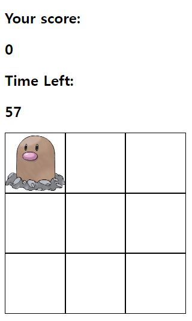

# Whack_A_Mole_Game

## Overview
Whack_A_Mole_Game is a simple web-based game where your task is to click on moles that randomly pop up within a grid. It's designed to test your reflexes and keep you entertained!

## Preview


## Features
- Random mole appearances within a 3x3 grid.
- Score tracking for successful clicks.
- Time limit of 60 seconds per game session.

## Technologies Used
- [](https://developer.mozilla.org/en-US/docs/Web/Guide/HTML/HTML5)
- [](https://developer.mozilla.org/en-US/docs/Web/CSS)
- [](https://developer.mozilla.org/en-US/docs/Web/JavaScript)

## How to Play
1.Clone this repository.
2. Open `index.html` in your preferred web browser.
3. Click on the grid square where the mole appears to earn points.
4. Your score and remaining time are shown at the top of the screen.
5. Try to score as high as possible before the timer runs out!
6. Enjoy the challenge and have fun!


## Installation
Clone the repository:
```bash
git clone https://github.com/Salkogi07/Whack_A_Mole.git
```

## Contributing
Contributions are welcome! If you have any suggestions, bug fixes, or improvements, please fork the repository and create a pull request.

## Credits
- Developed by SALKOGI07

## License
This project is licensed under the MIT License.
